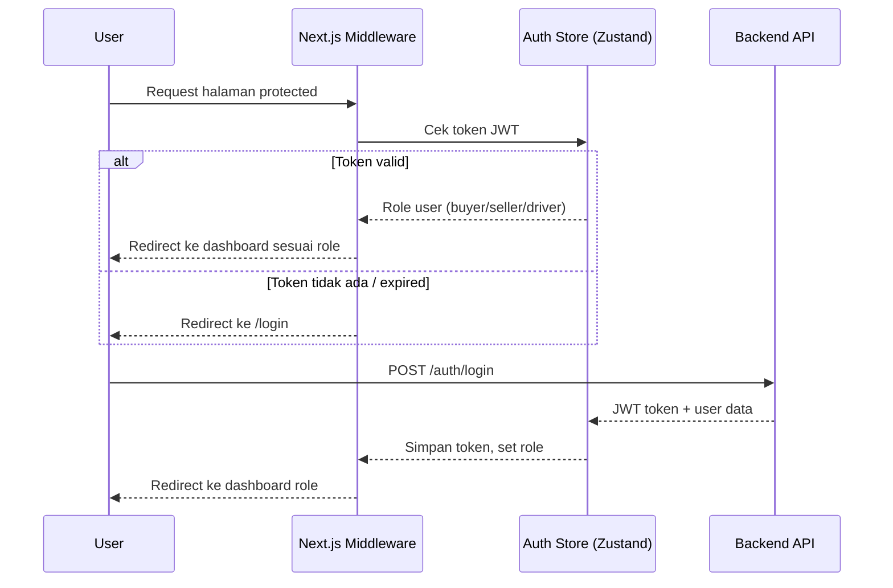
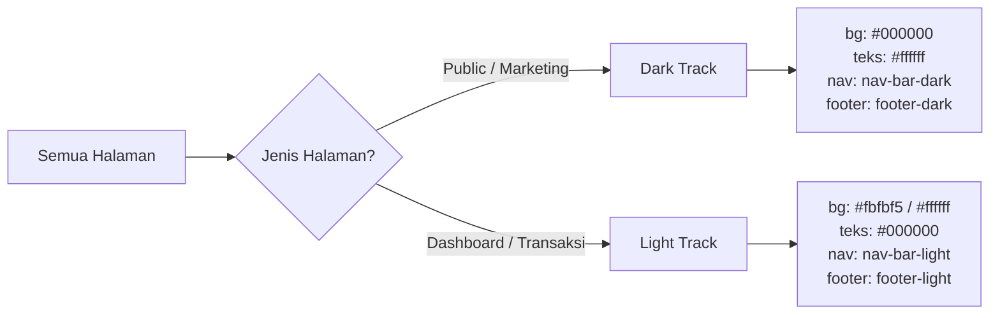
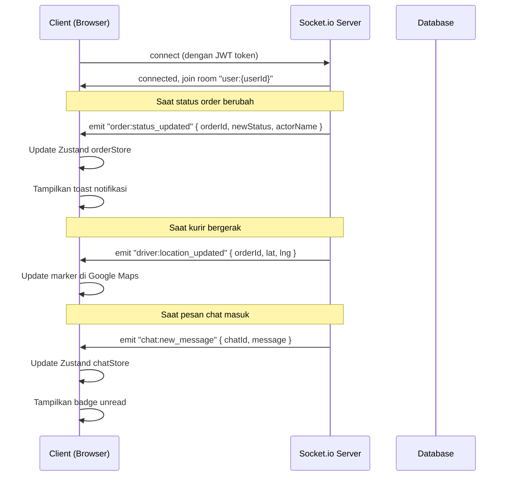
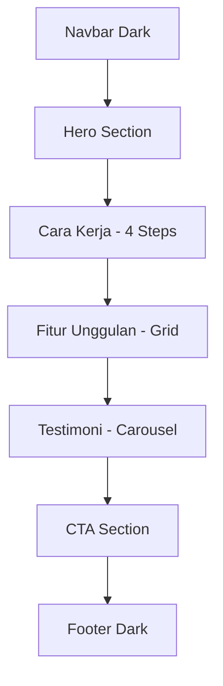
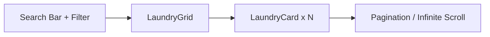

# Design Document: SiapLaundry Frontend

## Overview

SiapLaundry adalah marketplace laundry berbasis web yang dibangun dengan Next.js (App Router) dan TypeScript. Platform ini menghubungkan tiga peran pengguna — Pembeli, Penjual (Laundry Owner), dan Kurir (Driver) — melalui antarmuka yang bersih, responsif, dan real-time. Desain mengadopsi sistem dua kanvas terinspirasi Shopifi: **Cinematic/Dark Track** (`#000000`) untuk halaman marketing publik, dan **Transactional/Light Track** (`#ffffff`, `#fbfbf5`) untuk semua halaman dashboard dan transaksi.

Platform ini mencakup 25+ halaman yang dibagi ke dalam empat area utama: halaman publik (landing, auth), dashboard pembeli, dashboard penjual, dan dashboard kurir. Fitur real-time (tracking order, chat) ditenagai Socket.io client, sementara Google Maps API menangani visualisasi lokasi dan pickup.

---

## Architecture

### Diagram Arsitektur Tingkat Tinggi

```mermaid
graph TD
    subgraph "Next.js App Router"
        A[Root Layout] --> B[Public Layout - Dark Track]
        A --> C[Auth Layout]
        A --> D[Buyer Layout - Light Track]
        A --> E[Seller Layout - Light Track]
        A --> F[Driver Layout - Light Track]
    end

    subgraph "Public Pages"
        B --> G["/ (Landing)"]
        B --> H["/login"]
        B --> I["/register"]
    end

    subgraph "Buyer Pages"
        D --> J["/explore"]
        D --> K["/laundry/:id"]
        D --> L["/order/create"]
        D --> M["/my-orders"]
        D --> N["/order/:orderId"]
        D --> O["/order/:orderId/review"]
        D --> P["/chat"]
        D --> Q["/profile"]
    end

    subgraph "Seller Pages"
        E --> R["/seller/dashboard"]
        E --> S["/seller/orders"]
        E --> T["/seller/orders/:orderId"]
        E --> U["/seller/services"]
        E --> V["/seller/reviews"]
        E --> W["/seller/profile"]
    end

    subgraph "Driver Pages"
        F --> X["/driver/dashboard"]
        F --> Y["/driver/orders"]
        F --> Z["/driver/orders/:orderId"]
        F --> AA["/driver/profile"]
    end

    subgraph "State & Services"
        BB[Zustand Store] --> CC[Auth Store]
        BB --> DD[Order Store]
        BB --> EE[Chat Store]
        BB --> FF[Notification Store]
        GG[Socket.io Client] --> DD
        GG --> EE
        GG --> FF
        HH[Google Maps API] --> K
        HH --> L
        HH --> Z
    end
```



### Diagram Alur Autentikasi & Routing



---

## Struktur Folder Next.js

```
src/
├── app/                              # Next.js App Router
│   ├── layout.tsx                    # Root layout (font, global CSS, providers)
│   ├── page.tsx                      # Landing page (/)
│   ├── login/
│   │   └── page.tsx
│   ├── register/
│   │   └── page.tsx
│   ├── explore/
│   │   └── page.tsx
│   ├── laundry/
│   │   └── [id]/
│   │       └── page.tsx
│   ├── order/
│   │   ├── create/
│   │   │   └── page.tsx
│   │   └── [orderId]/
│   │       ├── page.tsx
│   │       └── review/
│   │           └── page.tsx
│   ├── my-orders/
│   │   └── page.tsx
│   ├── chat/
│   │   └── page.tsx
│   ├── profile/
│   │   └── page.tsx
│   ├── seller/
│   │   ├── layout.tsx                # Seller layout dengan sidebar
│   │   ├── dashboard/
│   │   │   └── page.tsx
│   │   ├── orders/
│   │   │   ├── page.tsx
│   │   │   └── [orderId]/
│   │   │       └── page.tsx
│   │   ├── services/
│   │   │   └── page.tsx
│   │   ├── reviews/
│   │   │   └── page.tsx
│   │   └── profile/
│   │       └── page.tsx
│   └── driver/
│       ├── layout.tsx                # Driver layout dengan bottom nav
│       ├── dashboard/
│       │   └── page.tsx
│       ├── orders/
│       │   ├── page.tsx
│       │   └── [orderId]/
│       │       └── page.tsx
│       └── profile/
│           └── page.tsx
│
├── components/                       # Komponen yang dapat digunakan ulang
│   ├── ui/                           # Komponen UI primitif (design system)
│   │   ├── Button.tsx
│   │   ├── Input.tsx
│   │   ├── Card.tsx
│   │   ├── Badge.tsx
│   │   ├── PillTag.tsx
│   │   ├── StarRating.tsx
│   │   ├── Avatar.tsx
│   │   ├── Modal.tsx
│   │   ├── Tabs.tsx
│   │   ├── Skeleton.tsx
│   │   └── Toast.tsx
│   ├── layout/                       # Komponen layout
│   │   ├── Navbar.tsx                # Nav dark (public) & light (dashboard)
│   │   ├── Footer.tsx
│   │   ├── SellerSidebar.tsx
│   │   ├── DriverBottomNav.tsx
│   │   └── BuyerTopNav.tsx
│   ├── landing/                      # Komponen khusus landing page
│   │   ├── HeroSection.tsx
│   │   ├── HowItWorksSection.tsx
│   │   ├── FeaturesSection.tsx
│   │   ├── TestimonialsSection.tsx
│   │   └── CTASection.tsx
│   ├── laundry/                      # Komponen terkait laundry
│   │   ├── LaundryCard.tsx
│   │   ├── LaundryGrid.tsx
│   │   ├── LaundryFilter.tsx
│   │   ├── ServiceTable.tsx
│   │   └── ReviewCard.tsx
│   ├── order/                        # Komponen terkait order
│   │   ├── OrderCard.tsx
│   │   ├── OrderTimeline.tsx
│   │   ├── OrderStatusBadge.tsx
│   │   ├── OrderSummary.tsx
│   │   └── WeightInput.tsx
│   ├── chat/                         # Komponen chat
│   │   ├── ChatSidebar.tsx
│   │   ├── ChatWindow.tsx
│   │   ├── MessageBubble.tsx
│   │   └── ChatInput.tsx
│   ├── maps/                         # Komponen Google Maps
│   │   ├── LocationPicker.tsx
│   │   ├── MapEmbed.tsx
│   │   └── DriverTracker.tsx
│   └── forms/                        # Form kompleks
│       ├── LoginForm.tsx
│       ├── RegisterBuyerForm.tsx
│       ├── RegisterSellerForm.tsx
│       ├── RegisterDriverForm.tsx
│       ├── OrderCreateForm.tsx
│       ├── ReviewForm.tsx
│       └── ServiceForm.tsx
│
├── stores/                           # Zustand stores
│   ├── authStore.ts
│   ├── orderStore.ts
│   ├── chatStore.ts
│   └── notificationStore.ts
│
├── hooks/                            # Custom React hooks
│   ├── useSocket.ts
│   ├── useGeolocation.ts
│   ├── useOrderTracking.ts
│   └── useChat.ts
│
├── lib/                              # Utilitas & konfigurasi
│   ├── api.ts                        # Axios instance + interceptors
│   ├── socket.ts                     # Socket.io client setup
│   ├── maps.ts                       # Google Maps helpers
│   └── utils.ts                      # Format currency, date, dll
│
├── types/                            # TypeScript type definitions
│   ├── user.ts
│   ├── order.ts
│   ├── laundry.ts
│   ├── chat.ts
│   └── api.ts
│
└── styles/
    └── globals.css                   # Tailwind directives + CSS variables
```

---

## Sistem Layout

### Dua Kanvas Track



### Layout Publik (Dark Track)

Digunakan oleh: `/`, `/login`, `/register`

```typescript
interface PublicLayoutProps {
  children: React.ReactNode
}
// Canvas: canvas-night (#000000)
// Navbar: nav-bar-dark (logo putih, tombol outline-on-dark)
// Footer: footer-dark (4 kolom link, muted tones)
// Max-width container: 1440px dengan edge-bleeding photography
```

### Layout Pembeli (Light Track)

Digunakan oleh: `/explore`, `/laundry/:id`, `/order/*`, `/my-orders`, `/chat`, `/profile`

```typescript
interface BuyerLayoutProps {
  children: React.ReactNode
}
// Canvas: canvas-cream (#fbfbf5)
// Navbar: nav-bar-light (sticky, logo hitam, avatar user)
// Navigasi: top navbar dengan link ke Explore, Pesanan, Chat, Profil
// Max-width: 1280px
```

### Layout Penjual (Light Track + Sidebar)

Digunakan oleh: semua halaman `/seller/*`

```typescript
interface SellerLayoutProps {
  children: React.ReactNode
}
// Canvas: canvas-cream (#fbfbf5)
// Sidebar kiri: lebar 240px, fixed, berisi navigasi seller
// Konten utama: margin-left 240px
// Sidebar items: Dashboard, Orders, Services, Reviews, Profile
```

### Layout Kurir (Light Track + Bottom Nav Mobile)

Digunakan oleh: semua halaman `/driver/*`

```typescript
interface DriverLayoutProps {
  children: React.ReactNode
}
// Canvas: canvas-cream (#fbfbf5)
// Desktop: sidebar kiri 240px
// Mobile: bottom navigation bar (4 item: Dashboard, Orders, Map, Profile)
// Dioptimalkan untuk penggunaan mobile (kurir di lapangan)
```

---

## Components and Interfaces

### Komponen UI Primitif

#### Button

```typescript
interface ButtonProps {
  variant: 'primary' | 'outline-dark' | 'outline-light' | 'aloe'
  size: 'sm' | 'md' | 'lg'
  children: React.ReactNode
  disabled?: boolean
  loading?: boolean
  onClick?: () => void
  type?: 'button' | 'submit' | 'reset'
  className?: string
}
// Semua varian menggunakan border-radius: 9999px (pill shape)
// Tidak ada varian rounded-rectangle
```

**Varian:**
- `primary`: bg `#000000`, teks `#ffffff` — CTA utama di light track
- `outline-dark`: border putih, teks putih — CTA di dark/cinematic track
- `outline-light`: border hitam, teks hitam — aksi sekunder di light track
- `aloe`: bg `#c1fbd4`, teks `#000000` — aksi featured/highlight

#### Card

```typescript
interface CardProps {
  variant: 'default' | 'pricing' | 'pricing-featured' | 'cinematic' | 'pistachio'
  children: React.ReactNode
  className?: string
  onClick?: () => void
}
```

#### Badge / OrderStatusBadge

```typescript
type OrderStatus =
  | 'pending_pickup'
  | 'driver_on_way_pickup'
  | 'picked_up'
  | 'at_laundry'
  | 'washing'
  | 'ready_for_delivery'
  | 'driver_on_way_delivery'
  | 'delivered'
  | 'completed'
  | 'cancelled'

interface OrderStatusBadgeProps {
  status: OrderStatus
}
// Setiap status memiliki warna dan label berbahasa Indonesia
```

#### StarRating

```typescript
interface StarRatingProps {
  value: number          // 1-5
  readonly?: boolean     // true = display only, false = interactive
  onChange?: (value: number) => void
  size?: 'sm' | 'md' | 'lg'
}
```

### Komponen LaundryCard

```typescript
interface LaundryCardProps {
  id: string
  name: string
  photos: string[]
  averageRating: number
  totalReviews: number
  distanceKm: number
  startingPrice: number  // harga terendah per kg
  isOpen: boolean
  services: string[]     // nama layanan yang tersedia
}
// Menampilkan: foto, nama, rating, jarak, harga mulai, badge buka/tutup
// Tombol: "Lihat Detail" → navigasi ke /laundry/:id
```

### Komponen OrderTimeline

```typescript
interface TimelineEvent {
  status: OrderStatus
  label: string
  timestamp: string | null
  actor?: string         // nama kurir atau penjual
  vehiclePlate?: string
}

interface OrderTimelineProps {
  events: TimelineEvent[]
  currentStatus: OrderStatus
}
// Menampilkan progress visual vertikal dengan ikon per status
// Status aktif ditandai dengan warna berbeda
```

### Komponen ChatWindow

```typescript
interface Message {
  id: string
  senderId: string
  senderName: string
  senderAvatar?: string
  content: string
  timestamp: string
  isRead: boolean
}

interface ChatWindowProps {
  orderId: string
  contactId: string
  contactName: string
  contactRole: 'seller' | 'driver'
  messages: Message[]
  onSendMessage: (content: string) => void
  isOnline: boolean
}
```

### Komponen LocationPicker (Google Maps)

```typescript
interface LocationPickerProps {
  initialLat?: number
  initialLng?: number
  onLocationSelect: (lat: number, lng: number, address: string) => void
  label?: string
}
// Menampilkan Google Maps dengan marker yang bisa di-drag
// Reverse geocoding otomatis saat marker dipindah
```

---

## Data Models

### User & Auth

```typescript
type UserRole = 'buyer' | 'seller' | 'driver'

interface AuthUser {
  id: string
  email: string
  phone: string
  name: string
  role: UserRole
  profilePhoto?: string
  isVerified: boolean
}

interface AuthState {
  user: AuthUser | null
  token: string | null
  isAuthenticated: boolean
  login: (credentials: LoginCredentials) => Promise<void>
  logout: () => void
  refreshToken: () => Promise<void>
}
```

### Laundry & Layanan

```typescript
interface Service {
  id: string
  sellerId: string
  serviceName: string
  pricePerUnit: number
  unit: 'kg' | 'pcs'
  estimatedDurationDays: number
  description?: string
  isActive: boolean
}

interface Seller {
  id: string
  laundryName: string
  ownerName: string
  address: string
  latitude: number
  longitude: number
  photos: string[]
  operatingHours: Record<string, string>  // { "monday": "08:00-20:00", ... }
  isOpen: boolean
  averageRating: number
  totalReviews: number
  distanceKm?: number  // dihitung di frontend berdasarkan lokasi user
  services: Service[]
}
```

### Order

```typescript
type OrderStatus =
  | 'pending_pickup'
  | 'driver_on_way_pickup'
  | 'picked_up'
  | 'at_laundry'
  | 'washing'
  | 'ready_for_delivery'
  | 'driver_on_way_delivery'
  | 'delivered'
  | 'completed'
  | 'cancelled'

type PickupTimeSlot = 'morning' | 'afternoon' | 'evening'

interface Order {
  id: string
  orderNumber: string
  buyerId: string
  seller: Pick<Seller, 'id' | 'laundryName' | 'photos'>
  service: Pick<Service, 'id' | 'serviceName' | 'pricePerUnit' | 'unit'>
  pickupAddress: string
  pickupLatitude: number
  pickupLongitude: number
  pickupDate: string
  pickupTimeSlot: PickupTimeSlot
  pickupDriver?: DriverInfo
  deliveryDriver?: DriverInfo
  estimatedWeight?: number
  actualWeight?: number
  estimatedPrice?: number
  finalPrice?: number
  deliveryFee: number
  totalPrice?: number
  status: OrderStatus
  buyerNotes?: string
  paymentStatus: 'pending' | 'paid'
  createdAt: string
  statusHistory: OrderStatusEvent[]
}

interface OrderStatusEvent {
  status: OrderStatus
  notes?: string
  createdAt: string
  actorName?: string
}

interface DriverInfo {
  id: string
  name: string
  phone: string
  vehiclePlate: string
  profilePhoto?: string
  currentLat?: number
  currentLng?: number
}
```

### Chat & Notifikasi

```typescript
interface ChatContact {
  id: string
  name: string
  role: 'seller' | 'driver'
  avatar?: string
  isOnline: boolean
  lastMessage?: string
  lastMessageTime?: string
  unreadCount: number
  orderId: string
}

interface Notification {
  id: string
  title: string
  message: string
  type: 'order' | 'chat' | 'review' | 'system'
  relatedId?: string
  isRead: boolean
  createdAt: string
}
```

---

## Desain Sistem Token (Tailwind Config)

```typescript
// tailwind.config.ts
const config = {
  theme: {
    extend: {
      colors: {
        'canvas-night': '#000000',
        'canvas-night-elevated': '#0a0a0a',
        'canvas-light': '#ffffff',
        'canvas-cream': '#fbfbf5',
        'surface-elevated-dark': '#1e2c31',
        'shade-30': '#d4d4d8',
        'shade-40': '#a1a1aa',
        'shade-50': '#71717a',
        'shade-60': '#52525b',
        'shade-70': '#3f3f46',
        'hairline-light': '#e4e4e7',
        'hairline-dark': '#1e2c31',
        'aloe-10': '#c1fbd4',
        'pistachio-10': '#d4f9e0',
        'ink': '#000000',
      },
      fontFamily: {
        display: ['NeueHaasGrotesk Display', 'Helvetica', 'Arial', 'sans-serif'],
        body: ['Inter Variable', 'Inter', 'Helvetica', 'Arial', 'sans-serif'],
      },
      borderRadius: {
        'pill': '9999px',
        'xs': '4px',
        'sm': '5px',
        'md': '8px',
        'lg': '12px',
        'xl': '20px',
      },
      spacing: {
        'xxs': '2px',
        'xs': '4px',
        'sm': '8px',
        'md': '12px',
        'lg': '16px',
        'xl': '24px',
        'xxl': '32px',
        'huge': '64px',
      }
    }
  }
}
```

---

## Alur Real-time (Socket.io)

### Diagram Koneksi Socket



### Custom Hook: useOrderTracking

```typescript
function useOrderTracking(orderId: string) {
  // Mengembalikan:
  // - currentStatus: OrderStatus
  // - statusHistory: OrderStatusEvent[]
  // - driverLocation: { lat: number, lng: number } | null
  // - isConnected: boolean
}
```

### Custom Hook: useChat

```typescript
function useChat(orderId: string, contactId: string) {
  // Mengembalikan:
  // - messages: Message[]
  // - sendMessage: (content: string) => void
  // - isTyping: boolean
  // - markAsRead: () => void
}
```

---

## Desain Per Halaman

### Halaman Landing (`/`) — Dark Track



**Hero Section:**
- Canvas: `canvas-night` (#000000)
- Headline: `display-xxl` (96px, weight 330) — "Laundry Dekat,\nJemput Antar,\nHarga Transparan"
- Sub-headline: `body-lg` (18px, weight 550) — warna `shade-40`
- CTA: `button-outline-on-dark` — "Cari Laundry Terdekat"
- Visual: ilustrasi/foto full-bleed di sisi kanan

**Cara Kerja Section:**
- Canvas: `canvas-night`
- 4 step cards menggunakan `card-feature-cinematic`
- Nomor step: `display-md` (48px, weight 330)
- Deskripsi: `body-md`

**Fitur Unggulan:**
- Canvas: `canvas-night`
- Grid 2x2 menggunakan `card-feature-cinematic`
- Icon + heading + deskripsi per card

**Testimoni:**
- Canvas: `canvas-night`
- Carousel horizontal dengan review card
- Avatar, nama, rating bintang, komentar

**CTA Section:**
- Canvas: `canvas-night` dengan aksen `aloe-10` sebagai highlight teks
- Tombol: `button-outline-on-dark`

---

### Halaman Login (`/login`) — Dark Track

```typescript
interface LoginPageLayout {
  // Split layout: kiri = branding/ilustrasi, kanan = form
  // Canvas: canvas-night
  // Form card: card-feature-cinematic dengan padding 32px
}
```

**Form Fields:**
- Email/No. Telepon: `text-input` (bg canvas-light di atas dark card)
- Password: `text-input` dengan toggle show/hide
- Checkbox "Ingat Saya": custom styled
- Link "Lupa Password?": `link-on-dark`

**Role Selection:**
- 3 tombol pill: "Masuk sebagai Pembeli", "Masuk sebagai Penjual", "Masuk sebagai Kurir"
- Varian: `button-outline-on-dark` (tidak aktif) / `button-primary-pill` (aktif/selected)

---

### Halaman Register (`/register`) — Dark Track

**Step 1: Pilih Role**
- 3 card besar dengan ikon dan deskripsi per role
- Varian: `card-feature-cinematic` dengan border highlight saat dipilih

**Step 2: Isi Form (berbeda per role)**
- Multi-step form dengan progress indicator
- LocationPicker (Google Maps) untuk input alamat
- File upload untuk foto KTP/SIM (kurir)

---

### Halaman Explore (`/explore`) — Light Track



**Filter Panel:**
- Jarak: radio buttons (1km, 3km, 5km, 10km+)
- Rating: checkbox (4+, 3+, 2+)
- Harga: range slider
- Layanan: checkbox multi-select
- Tombol "Terapkan Filter": `button-primary-pill`

**LaundryCard:**
- Canvas: `canvas-light` dengan shadow Level 3
- Foto: aspect-ratio 16:9, `rounded-lg`
- Badge "Buka"/"Tutup": `pill-tag-mint` / `pill-tag-shade`
- Rating: StarRating (readonly) + jumlah ulasan
- Jarak: ikon lokasi + teks
- Harga mulai: `body-strong`
- Tombol: `button-primary-pill` — "Lihat Detail"

---

### Halaman Detail Laundry (`/laundry/:id`) — Light Track

**Header:**
- Foto carousel (3-5 foto), `rounded-xl`
- Nama laundry: `heading-xl`
- Rating + total ulasan + jarak
- Badge status buka/tutup: `pill-tag-mint` / `pill-tag-shade`
- Jam operasional

**Tabel Layanan:**
- Kolom: Layanan, Harga, Estimasi Waktu, Aksi
- Tombol tambah ke order: `button-aloe-pill` — "[+] Pilih"
- Sticky CTA di bawah: `button-primary-pill` — "Pesan Sekarang"

**Peta Lokasi:**
- Google Maps embed, `rounded-lg`
- Alamat lengkap di bawah peta

**Ulasan:**
- Summary rating dengan breakdown bintang
- Filter tabs: Terbaru, Tertinggi, Terendah
- ReviewCard: avatar, nama, rating, tanggal, komentar, foto (jika ada)

---

### Halaman Buat Order (`/order/create`) — Light Track

**Multi-step form (3 langkah):**

Step 1 — Pilih Layanan:
- Layanan yang dipilih dari halaman detail laundry
- Slider estimasi berat (1-20 kg)
- Kalkulasi harga estimasi real-time

Step 2 — Alamat & Jadwal:
- Pilih alamat tersimpan atau tambah baru
- LocationPicker untuk pin lokasi
- Date picker untuk tanggal pickup
- Time slot selector: Pagi (08-12), Siang (12-15), Sore (15-18)
- Textarea catatan (opsional)

Step 3 — Konfirmasi:
- Ringkasan order lengkap
- Estimasi total harga
- Tombol "Konfirmasi Pesanan": `button-primary-pill`

---

### Halaman My Orders (`/my-orders`) — Light Track

**Tab Navigation:**
- Berlangsung | Selesai | Dibatalkan
- Menggunakan komponen Tabs

**OrderCard (Berlangsung):**
- Foto laundry kecil + nama laundry
- Nomor order: `caption` style
- OrderStatusBadge dengan warna sesuai status
- Timeline ringkas (2-3 event terakhir)
- Action buttons: Chat, Lacak Kurir, Lihat Detail

---

### Halaman Detail Order (`/order/:orderId`) — Light Track

**OrderTimeline:**
- Progress bar vertikal dengan semua status
- Status aktif: warna `aloe-10` atau `ink`
- Status selesai: ikon centang
- Status mendatang: warna `shade-30`

**Info Kurir:**
- Avatar, nama, plat kendaraan
- Tombol "Chat Kurir": `button-outline-light`
- Tombol "Lacak di Maps": `button-primary-pill`

**Rincian Pembayaran:**
- Card dengan breakdown biaya
- Total: `heading-md` bold

---

### Halaman Review (`/order/:orderId/review`) — Light Track

**Form:**
- StarRating interaktif untuk laundry (1-5)
- Textarea ulasan laundry
- StarRating interaktif untuk kurir (1-5)
- Upload foto (opsional): drag & drop area
- Tombol "Kirim Ulasan": `button-primary-pill`

---

### Halaman Chat (`/chat`) — Light Track

**Layout Split:**
- Kiri (320px): ChatSidebar — list kontak dengan unread badge
- Kanan: ChatWindow — pesan dengan bubble style
  - Pesan sendiri: bubble kanan, bg `aloe-10`
  - Pesan masuk: bubble kiri, bg `canvas-light` dengan border

---

### Dashboard Penjual (`/seller/dashboard`) — Light Track

**Widget Cards (grid 2x2):**
- Total Order Bulan Ini: angka besar + trend
- Total Pendapatan: format Rupiah
- Rating Rata-rata: bintang + angka
- Order Baru: badge merah jika ada

**Tabel Recent Orders:**
- Kolom: No. Order, Pembeli, Layanan, Status, Aksi
- Tombol "Lihat Detail": `button-outline-light`

---

### Halaman Order Management Penjual (`/seller/orders`) — Light Track

**Tab:** Order Baru | Sedang Proses | Siap Diantar | Selesai

**OrderCard Penjual:**
- Info pembeli + layanan + estimasi berat
- Tombol update status sesuai tab aktif:
  - "Konfirmasi Order": `button-aloe-pill`
  - "Mulai Cuci": `button-primary-pill`
  - "Selesai Dicuci": `button-primary-pill`

---

### Dashboard Kurir (`/driver/dashboard`) — Light Track

**Status Toggle:**
- Toggle besar Online/Offline di bagian atas
- Warna: Online = `aloe-10`, Offline = `shade-30`

**Widget Cards:**
- Order Hari Ini
- Total Pengantaran Bulan Ini
- Pendapatan Bulan Ini

---

### Halaman Order Kurir (`/driver/orders`) — Light Track

**Tab:** Pickup (Jemput) | Delivery (Antar)

**OrderCard Kurir:**
- Alamat pickup/delivery
- Jarak dari lokasi kurir saat ini
- Tombol aksi: "Ambil Order" / "Mulai Pickup" / "Mulai Delivery"
- Tombol "Buka di Maps": `button-outline-light`

---

## Error Handling

### Skenario Error 1: Koneksi Socket Terputus

**Kondisi:** Socket.io client kehilangan koneksi ke server  
**Respons:** Tampilkan banner "Koneksi terputus, mencoba menghubungkan kembali..." di bagian atas halaman  
**Pemulihan:** Auto-reconnect dengan exponential backoff; banner hilang saat koneksi pulih

### Skenario Error 2: Gagal Memuat Data Laundry

**Kondisi:** API `/laundry` mengembalikan error atau timeout  
**Respons:** Tampilkan skeleton loading selama 3 detik, lalu tampilkan pesan error dengan tombol "Coba Lagi"  
**Pemulihan:** Tombol "Coba Lagi" memicu ulang fetch

### Skenario Error 3: Lokasi Tidak Tersedia

**Kondisi:** User menolak izin geolokasi browser  
**Respons:** Tampilkan modal meminta user untuk input lokasi manual  
**Pemulihan:** LocationPicker dengan input teks + geocoding

### Skenario Error 4: Upload File Gagal

**Kondisi:** Upload foto (profil, KTP, SIM, review) gagal  
**Respons:** Toast error "Gagal mengunggah foto. Pastikan ukuran file < 5MB"  
**Pemulihan:** User dapat mencoba ulang upload

### Skenario Error 5: Sesi Expired

**Kondisi:** JWT token expired saat user sedang aktif  
**Respons:** Interceptor Axios mendeteksi 401, coba refresh token  
**Pemulihan:** Jika refresh gagal, redirect ke `/login` dengan pesan "Sesi Anda telah berakhir"

---

## Testing Strategy

### Pendekatan Unit Testing

Fokus pada komponen UI primitif dan fungsi utilitas:
- Komponen Button: semua varian dan state (disabled, loading)
- Komponen OrderStatusBadge: semua status order
- Fungsi `formatCurrency`: berbagai nilai Rupiah
- Fungsi `calculateOrderPrice`: kalkulasi harga dengan berat aktual
- Zustand stores: auth, order, chat state transitions

### Pendekatan Property-Based Testing

**Library PBT:** fast-check (TypeScript)

Kandidat property test:
- Kalkulasi harga order: untuk semua kombinasi berat dan harga per unit yang valid, total harga harus selalu ≥ biaya antar-jemput
- Format nomor order: untuk semua order yang dibuat, nomor order harus selalu mengikuti format `SL{YYYYMMDD}{sequence}`
- Filter laundry: untuk semua kombinasi filter yang valid, hasil filter harus selalu merupakan subset dari data asli
- Serialisasi/deserialisasi state: untuk semua state Zustand yang valid, serialize ke localStorage dan deserialize kembali harus menghasilkan state yang ekuivalen

### Pendekatan Integration Testing

- Alur login → redirect ke dashboard sesuai role
- Alur buat order end-to-end (pilih laundry → isi form → konfirmasi)
- Alur update status order (penjual update → pembeli menerima notifikasi real-time)
- Alur chat (kirim pesan → pesan muncul di sisi penerima)

---

## Pertimbangan Performa

- **Image Optimization:** Gunakan `next/image` dengan `srcset` dan lazy loading untuk semua foto laundry
- **Code Splitting:** Setiap route segment di-lazy load secara otomatis oleh Next.js App Router
- **Google Maps:** Load Google Maps SDK secara lazy hanya pada halaman yang membutuhkan (explore, order create, driver order)
- **Socket.io:** Koneksi socket hanya dibuat saat user terautentikasi; disconnect saat user logout
- **Zustand Persistence:** Hanya auth token yang di-persist ke localStorage; data order/chat di-fetch ulang saat mount
- **Skeleton Loading:** Semua halaman dengan data async menampilkan skeleton sebelum data tersedia

---

## Pertimbangan Keamanan

- **JWT Storage:** Token disimpan di httpOnly cookie (bukan localStorage) untuk mencegah XSS
- **Route Protection:** Next.js middleware memvalidasi token sebelum render halaman protected
- **Input Sanitization:** React Hook Form dengan Zod schema validation untuk semua form input
- **File Upload:** Validasi tipe file (image/jpeg, image/png) dan ukuran maksimal (5MB) di sisi client sebelum upload
- **API Calls:** Semua request menggunakan HTTPS; Axios interceptor menambahkan Authorization header secara otomatis
- **Role-based Access:** Middleware memverifikasi role user sesuai prefix route (`/seller/*` hanya untuk role `seller`)

---

## Dependensi

| Paket | Versi | Kegunaan |
|-------|-------|----------|
| next | 14.x | Framework utama (App Router) |
| react | 18.x | UI library |
| typescript | 5.x | Type safety |
| tailwindcss | 3.x | Styling |
| zustand | 4.x | State management |
| react-hook-form | 7.x | Form handling |
| zod | 3.x | Schema validation |
| socket.io-client | 4.x | Real-time communication |
| @react-google-maps/api | 2.x | Google Maps integration |
| axios | 1.x | HTTP client |
| date-fns | 3.x | Date formatting |
| fast-check | 3.x | Property-based testing |
| @testing-library/react | 14.x | Component testing |
| vitest | 1.x | Test runner |

---

## Correctness Properties

*Properti adalah karakteristik atau perilaku yang harus berlaku di semua eksekusi sistem yang valid — pernyataan formal tentang apa yang seharusnya dilakukan sistem. Properti berfungsi sebagai jembatan antara spesifikasi yang dapat dibaca manusia dan jaminan kebenaran yang dapat diverifikasi mesin.*

### Property 1: Kalkulasi Harga Order Selalu Konsisten

Untuk semua kombinasi berat aktual (> 0) dan harga per unit (> 0) yang valid, total harga order harus selalu sama dengan `(berat × harga_per_unit) + biaya_antar_jemput`, dan total harga harus selalu lebih besar dari biaya antar-jemput saja.

**Validates: Requirements 7.2, 7.10, 12.6**

### Property 2: Filter Laundry Menghasilkan Subset Valid

Untuk semua kombinasi parameter filter yang valid (jarak, rating, harga, layanan) dan semua dataset laundry yang valid, hasil filter harus selalu merupakan subset dari dataset asli, dan setiap item dalam hasil filter harus memenuhi semua kriteria filter yang diterapkan.

**Validates: Requirements 5.4, 5.5, 5.6, 5.7, 5.8, 5.9**

### Property 3: Serialisasi State Auth Round-Trip

Untuk semua objek `AuthUser` yang valid, menyimpan ke localStorage kemudian membaca kembali harus menghasilkan objek yang ekuivalen (deep equality).

**Validates: Requirements 2.8**

### Property 4: Status Order Hanya Maju (Tidak Mundur)

Untuk semua transisi status order yang valid, status baru harus selalu berada di posisi yang lebih tinggi dalam urutan status yang telah ditentukan (kecuali transisi ke `cancelled` yang dapat terjadi dari beberapa status awal yang diizinkan).

**Validates: Requirements 8.10**

### Property 5: Validasi Input Whitespace Konsisten

Untuk semua string yang terdiri sepenuhnya dari karakter whitespace (spasi, tab, newline) dengan panjang berapa pun, validasi form harus selalu menolak input tersebut sebagai field yang kosong/tidak valid.

**Validates: Requirements 3.7**

### Property 6: Role-Based Access Control Konsisten

Untuk semua kombinasi role pengguna yang valid (`buyer`, `seller`, `driver`) dan semua rute yang tidak sesuai dengan role tersebut, middleware autentikasi harus selalu melakukan redirect ke dashboard yang sesuai dengan role pengguna, tanpa pengecualian.

**Validates: Requirements 2.1, 2.2, 2.3, 2.4**

### Property 7: Validasi Ukuran dan Tipe File Upload

Untuk semua file yang diupload, validasi harus selalu menolak file dengan ukuran > 5MB atau tipe bukan `image/jpeg` atau `image/png`, terlepas dari nama file atau metadata lainnya.

**Validates: Requirements 3.8, 3.9**
